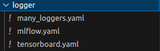
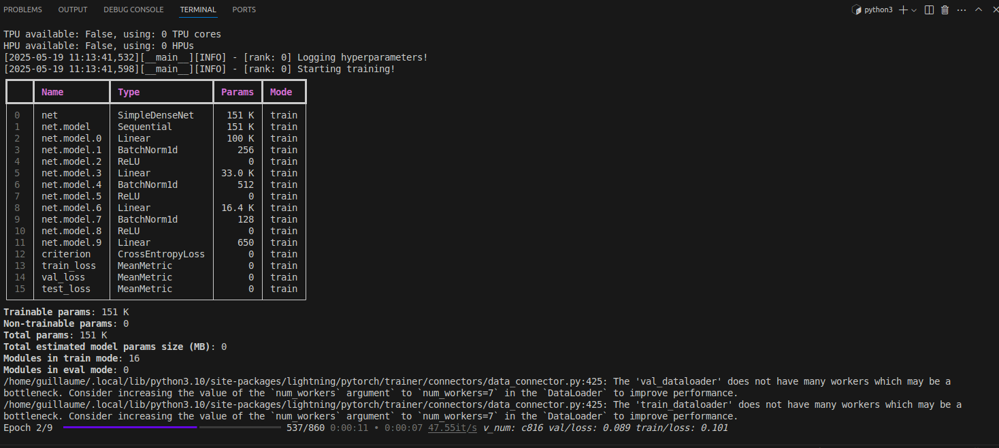

# ⚙️ Introduction to Hydra in the Lightning-Hydra-Template

---

## 🔍 What is Hydra?

- Hydra is a **configuration framework** developed by **Facebook Research**.
- Used in the **Lightning-Hydra-Template** to:
  - Manage **hierarchical configurations**.
  - Modify settings dynamically via YAML or CLI.
- Hydra dynamically instantiates target classes (via the `_target_` key) in `train.py` using config files.

---

## 🗂️ Configuration Structure

configs/
├── common # Folder with many configs (hydra, trainer, and paths in config_base.yaml)  
├── data/ # Datasets  
├── experiment/ # Experiments  
├── model/ # Models  

── train.yaml # Main training config  
── eval.yaml # Main evaluation config  

---

The main file is `configs/train.yaml`, which defines the default training configuration.

train.yaml:5-10
```yaml
# @package _global_

# specify here default configuration
# order of defaults determines the order in which configs override each other
defaults:
  - _self_
  - common/config_base
  - data: mnist
  - model: mnist
  - /common/callbacks@callbacks: default  # Notation explicite  
  - /common/logger@logger: mlflow   # set logger here or use command line (e.g. `python train.py logger=tensorboard`)

  # experiment configs allow for version control of specific hyperparameters
  # e.g. best hyperparameters for given model and datamodule
  - experiment: null

  ...
```
---
The script train.py loads the default training configuration defined in configs/train.yaml, which itself includes all paths, trainer settings, model, data, callbacks, and logger.

To launch a training run with the default configuration, simply run:
```bash
  python src/train.py 
```

---
We will load `configs/common/config_base.yaml`, which contains the trainer parameters and paths.

```yaml
# ---------- PATHS ----------
paths:
  root_dir: ${oc.env:PROJECT_ROOT}  # Root directory of the project, set via environment variable
  data_dir: ${paths.root_dir}/data/  # Directory where the datasets are stored
  log_dir: ${paths.root_dir}/logs/  # Directory where logs will be saved
  output_dir: ${hydra:runtime.output_dir}  # Output directory generated by Hydra for each run
  work_dir: ${hydra:runtime.cwd}  # Current working directory where the job is launched

# ---------- TRAINER ----------
trainer:
  _target_: lightning.pytorch.trainer.Trainer #target class for trainer
  default_root_dir: ${paths.output_dir}
  min_epochs: 1
  max_epochs: 10
  accelerator: gpu 
  ...
```
---
We also load the datamodule (in this case, MNIST):`configs/data/mnist.yaml`
```yaml
_target_: src.data.mnist_datamodule.MNISTDataModule #target class for datamodule
data_dir: ${paths.data_dir}
batch_size: 128 # Needs to be divisible by the number of devices (e.g., if in a distributed setup)
train_val_test_split: [55_000, 5_000, 10_000]
num_workers: 0
pin_memory: False

```
---
We load our model (MNIST):`configs/model/mnist.yaml`
```yaml
_target_: src.models.mnist_module.MNISTLitModule #target class for the model

optimizer:
  _target_: torch.optim.Adam #target class for the optimizer
  _partial_: true
  lr: 0.001
  weight_decay: 0.0

scheduler:
  _target_: torch.optim.lr_scheduler.ReduceLROnPlateau #target class for the scheduler
  _partial_: true
  mode: min
  factor: 0.1
  patience: 10

net:
  _target_: src.models.components.simple_dense_net.SimpleDenseNet #target class selfmade for the net
  input_size: 784
  lin1_size: 64
  lin2_size: 128
  lin3_size: 64
  output_size: 10

# compile model for faster training with pytorch 2.0
compile: false

# learning rate scheduler update interval: "epoch" or "step"
lr_interval: epoch
```
---
We also load the callbacks: `configs/common/callbacks/default.yaml`
```yaml
defaults:
  - model_checkpoint
  - early_stopping
  - model_summary
  - rich_progress_bar
  - callback_images
  - _self_

  ...
```
This file lists the callbacks we want to use by default.

---
Finally, we load the logger from `configs/common/logger`— here are the available options:



---

## ⚙️ How to Modify Configuration Variables

You can change values in several ways:

 1. Direct Modification in YAML Files

  Change values directly in YAML files. For example, modify the number of max epochs in `configs/common/config_base.yaml`:
```yaml
trainer:
  _target_: lightning.pytorch.trainer.Trainer
  default_root_dir: ${paths.output_dir}
  min_epochs: 1
  max_epochs: 10
  accelerator: gpu 
  devices: 1
  check_val_every_n_epoch: 1
  deterministic: false
```

---

  2. Override via Command Line

  Change one or more parameters without modifying YAML files:

  ```bash
  python src/train.py model.optimizer.lr=0.001 data.batch_size=64
  ```

  3. Alternative Configurations

  Use a different model or logger:

  ```bash
  python src/train.py model=autre_modele common/logger@logger=nom_logger
  ```

  IMPORTANT: To override logger or callbacks, use the following syntax:

  ```bash
  python src/train.py common/logger@logger=nom_logger
  ```

  ```bash
  python src/train.py common/callbacks@callbacks=nom_callbacks
  ```

---

## 🧪 Experiment Configurations

Goal: 

Define a full experiment configuration in a single YAML file
(to avoid manually changing all individual config files):

- Model
- Dataset
- Callbacks
- Number of epochs
- Seed

---

Example: `configs/experiment/mon_experience.yaml`

```yaml
# @package _global_
defaults:  
  - override /data: mnist  
  - override /model: mnist  
  - override /common/callbacks@callbacks: default  
  - override /common/logger@logger: mlflow  
  
# Paramètres spécifiques à cette expérience  
tags: ["mnist"]  
  
# Surcharger des paramètres spécifiques  
trainer:  
  max_epochs: 10  
  min_epochs: 5  
  gradient_clip_val: 0.5
  accelerator: cpu  
  devices: 1
  
model:  
  optimizer:  
    lr: 0.002  
  net:  
    lin1_size: 128  
    lin2_size: 256  
    lin3_size: 64  
  
data:  
  batch_size: 64
```

---

Then launch your training with:

```bash
    python src/train.py experiment=mon_experience
```
This will load:
  -MNIST dataset
  -MNIST model
  -Default callbacks
  -Seed 12345
  -20 epochs
  -Learning rate of 0.002

So, before overriding parameters in an experiment, refer to the original config file to check the variable structure.

---

## ✅ Final Check

If everything went well...

You should see this image generated at the start of training in the terminal:




